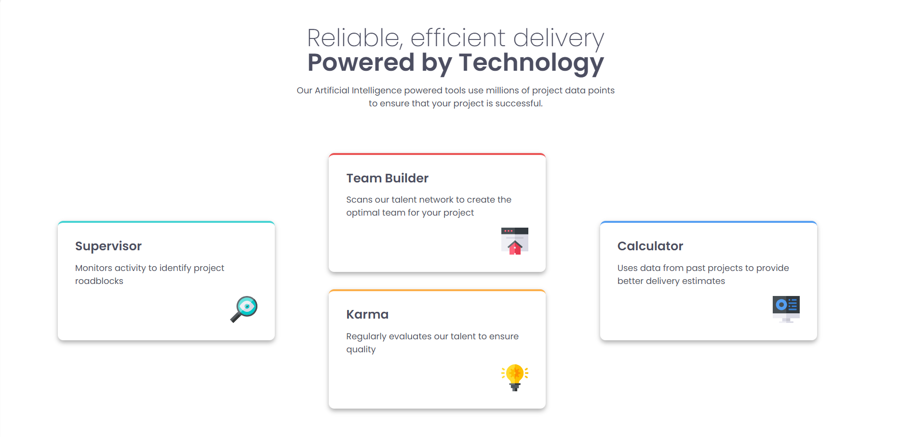
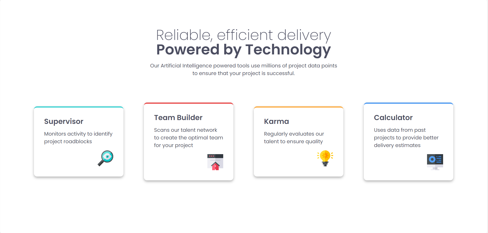

# Four Card Feature Section

This is a solution to the [Four Card Feature Section challenge on Frontend Mentor](https://www.frontendmentor.io/challenges/four-card-feature-section-weK1eFYK). This project features **two different approaches** to responsive design, exploring modern CSS methodologies and layout techniques.

## The Challenge

Users should be able to:

- View the optimal layout for the site depending on their device's screen size
- See a visually appealing four-card layout that adapts seamlessly from desktop to mobile
- Experience a clean, modern design with proper spacing and typography hierarchy

## Preview

## Project Structure

This repository contains **two distinct implementations**:

### 1. **Original Design** (`index.html` + `style.css`)
- Faithful implementation matching Frontend Mentor's design specifications
- Traditional responsive approach with media queries

### 2. **Andy Bell's Methodology** (`second-index.html` + `second-index.css`)
- Implementation following **"Be the browser's mentor, not its micromanager"** principles
- Fluid responsive design with minimal media queries
- Modern CSS techniques focusing on intrinsic web design

## Built With

### Common Technologies:
- **Semantic HTML5** markup for accessible structure
- **CSS3 custom properties** for consistent theming
- **CSS Grid & Flexbox** for modern layout techniques
- **Google Fonts (Poppins)** for typography

### Original Implementation:
- Mobile-first workflow
- Traditional media queries
- Pixel-perfect design matching

### Andy Bell's Approach:
- **Utopia Fluid Type Scale** for responsive typography
- **Intrinsic web design** principles
- **Fluid spacing** and layouts
- **Container-query-like** thinking
- Minimal breakpoint usage

## Research & Methodology

This project was heavily influenced by **Andy Bell's "Be the browser's mentor, not its micromanager"** philosophy. The main focus was to practice and implement truly responsive websites that work across all devices without relying on media queries.

### Key Principles Applied:
- **Fluid typography** using `clamp()` and viewport units
- **Intrinsic design** allowing elements to naturally adapt to available space
- **Progressive enhancement** rather than pixel-perfect control at every breakpoint
- **CSS custom properties** for systematic design tokens

## What I Learned

### Technical Skills:
- **Advanced CSS Grid** techniques using `grid-template-areas` for complex layouts
- **Fluid typography** implementation using Utopia scale for optimal readability
- **Color system management** with CSS custom properties for maintainable theming
- **Comparative analysis** of different responsive design approaches

### Conceptual Insights:
- The importance of **intrinsic web design** over breakpoint-heavy approaches
- How to **trust the browser's layout engine** rather than micromanaging every detail
- **Systematic CSS architecture** using design tokens and custom properties
- **Performance considerations** in responsive design implementations

## Comparative Analysis

Having built both implementations, I gained valuable insights into:

- **Maintainability**: Andy Bell's approach often results in more maintainable, future-proof code
- **Performance**: Fluid designs can reduce CSS file size and complexity
- **Developer Experience**: Systematic approaches provide clearer mental models
- **Browser Compatibility**: Balancing modern techniques with practical constraints

## Future Improvements

For future iterations or similar projects, I would like to:

- Add subtle animations or transitions for card interactions
- Implement dark/light mode toggling using CSS custom properties
- Explore CSS container queries for more granular responsive control
- Conduct user testing to compare the effectiveness of both approaches
- Implement a design token system for even more systematic styling

## Author

Developed by **Ana Mateus Neves**

- GitHub: [@anamateusn](https://github.com/anamateusn)
- Frontend Mentor: [@anamateusn](https://www.frontendmentor.io/profile/anamateusn)

## Acknowledgments

Special thanks to:
- **Frontend Mentor** for providing realistic challenges that bridge learning with real-world application
- **Andy Bell** for the inspirational talk "Be the browser's mentor, not its micromanager" that shaped the second implementation
- The web development community for continuous learning and sharing of knowledge

This project represents my ongoing journey in exploring modern CSS methodologies and understanding the evolution of responsive web design practices.

---

**Note**: This dual-approach project demonstrates how the same design challenge can be solved using different philosophies, providing valuable insights into modern CSS development practices.
